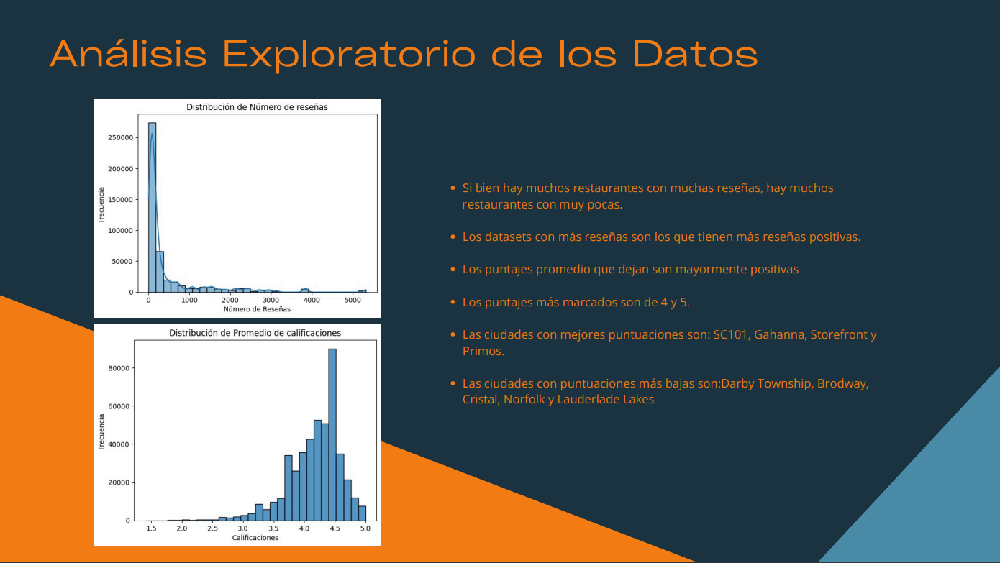
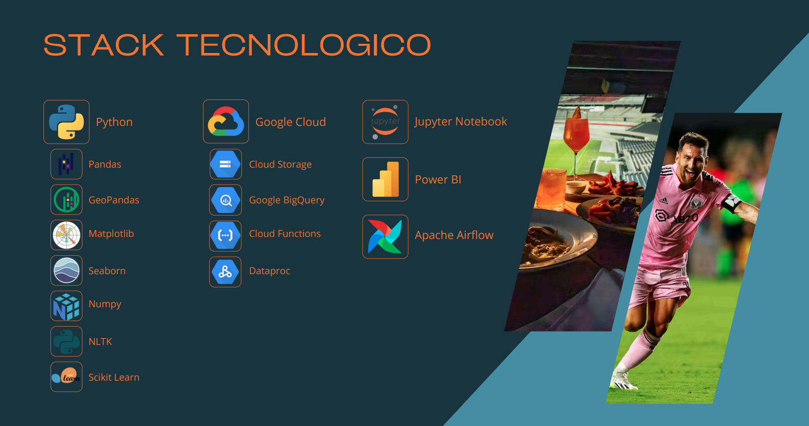
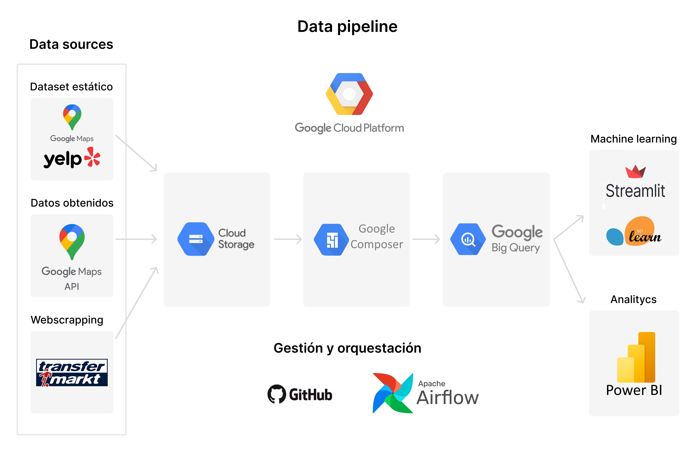
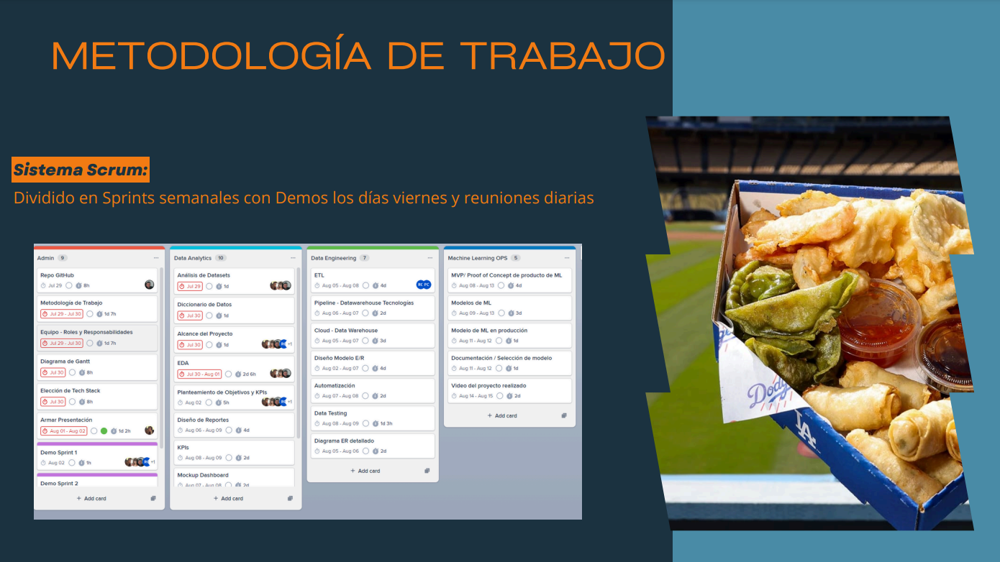
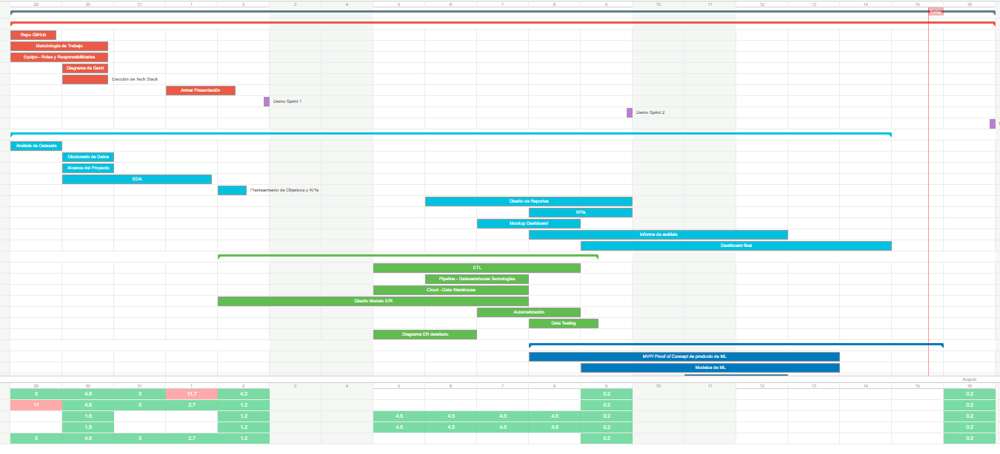

<Logo de HorizonData>

***
# 
Análisis de Reseñas de Locales Gastronómicos Cercanos a Estadios de la MLS

## Índice

  
Tabla de contenido

  1. [Índice](#índice)
  2. [Sobre el proyecto](#sobre-el-proyecto)
  3. [Guía paso a paso](#guía-paso-a-paso)
  4. [KPI](#kpi)
  5. [Tecnologías Seleccionadas](#tecnologías-seleccionadas)
  6. [PipeLine](#pipeline)
  7. [Cronología](#cronología)
  8. [Dashboard de Análisis](#dashboard-de-análisis)
  9. [Sistema de Recomendación](#sistema-de-recomendación)
  10. [Miembros del Equipo](#miembros-del-equipo)

## Sobre el proyecto

**Objetivo**
 El objetivo es brindar a una compañía administradora de estadios de la Major League Soccer (MLS)   la información necesaria para definir la concesión de sus locales gastronómicos y monitorear la calidad del servicio.

**Alcance**
<Mapa con estadios>

## Guía Paso a Paso

*__Paso 1: ETL (Extracción, Transformación y Carga)__*

Lorem ipsum dolor sit amet, consectetur adipiscing elit. Suspendisse vel augue imperdiet, maximus mi nec, posuere orci. Integer tempus sodales magna, id sodales ex tempor id. Nulla facilisi. Lorem ipsum dolor sit amet, consectetur adipiscing elit. Morbi condimentum porttitor ultrices. 

*__Paso 2: Análisis Exploratorio de Datos (EDA)__*

*__Paso 3: Dashboard__*

Lorem ipsum dolor sit amet, consectetur adipiscing elit. Suspendisse vel augue imperdiet, maximus mi nec, posuere orci. Integer tempus sodales magna, id sodales ex tempor id. Nulla facilisi. Lorem ipsum dolor sit amet, consectetur adipiscing elit. Morbi condimentum porttitor ultrices. 

*__Paso 4: Modelo de Recomendación__*

Lorem ipsum dolor sit amet, consectetur adipiscing elit. Suspendisse vel augue imperdiet, maximus mi nec, posuere orci. Integer tempus sodales magna, id sodales ex tempor id. Nulla facilisi. Lorem ipsum dolor sit amet, consectetur adipiscing elit. Morbi condimentum porttitor ultrices. 

## KPI
Los indicadores clave de rendimiento nos ayudarán a enfocarnos en objetivos claros y medibles para impulsar el éxito de nuestros establecimientos.

__1.  Crecimiento del nivel de satisfacción__

  - *KPI:* Incrementar en un decimal (+0,10) la calificación promedio de Google Maps
  - *Definición:* Crecimiento del nivel de satisfacción de los clientes respecto del mes anterior para el conjunto de locales gastronómicos en los estadios.
  - *Objetivo:* +0,10

__2. Aumentar las reseñas__

  - *KPI:* Aumentar en un 5% mensual la cantidad de reseñas
  - *Definición:*  Expansión del volumen de interacciones total respecto del mes anterior.
  - *Objetivo:* +5%

__3. Disminuir reseñas negativas (calificación 1 o 2)__

  - *KPI:* Disminuir en un 5% el porcentaje de reseñas negativas (calificación 1 o 2)
  - *Definición:* Mejoramiento del nivel de satisfacción de los clientes respecto al mes anterior logrando una caía en las reseñas negativas.
  - *Objetivo:* -5%

## Tecnologías Seleccionadas

## PipeLine
El pipeline de datos, ilustrado en el siguiente diagrama, describe el flujo de datos desde su ingesta inicial hasta su análisis y modelado final. Este pipeline está diseñado para ser escalable, eficiente y automatizado, asegurando la integridad y disponibilidad de los datos en cada etapa del proceso. 

## Cronología
A lo largo del proyecto utilizamos la metodología Scrum

## Estructuramos nuestro Gantt en cuatro áreas clave:

  - __Administración:__ Encargado de la gestión general y la coordinación de todos los departamentos. 
  - __Data Analytics:__ Responsable de analizar los datos de las reseñas y la satisfacción del cliente para proporcionar insights accionables. 
  - __Data Engineering:__ Se ocupa de la infraestructura y las herramientas necesarias para recopilar y procesar los datos de manera eficiente. 
  - __Machine Learning OPS:__ Enfocado en desarrollar modelos predictivos que nos ayuden a anticipar tendencias y mejorar la toma de decisiones. 

## Dashboard de Análisis
Lorem ipsum dolor sit amet, consectetur adipiscing elit. Suspendisse vel augue imperdiet, maximus mi nec, posuere orci. Integer tempus sodales magna, id sodales ex tempor id. Nulla facilisi. Lorem ipsum dolor sit amet, consectetur adipiscing elit. Morbi condimentum porttitor ultrices. 

## Sistema de Recomendación
Lorem ipsum dolor sit amet, consectetur adipiscing elit. Suspendisse vel augue imperdiet, maximus mi nec, posuere orci. Integer tempus sodales magna, id sodales ex tempor id. Nulla facilisi. Lorem ipsum dolor sit amet, consectetur adipiscing elit. Morbi condimentum porttitor ultrices. 

## Miembros del Equipo

 - Renato Giovanetti 
 - Pablo Clementi 
 - Guillermo Gerbaldo 
 - Eugenia Memolli 
 - Jessica Sandagorda 

## Agradecimientos.
